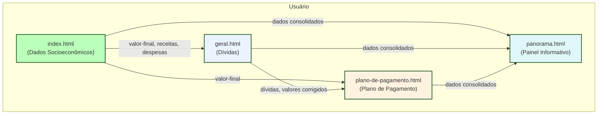

# Histórico do Projeto: Superendividamento

## Novidades / Alterações Recentes

- **[2024-12-XX] Sistema de Correção Monetária com API do Banco Central:** Implementada funcionalidade completa de correção monetária que integra com a API oficial do Banco Central para obter índices em tempo real (IPCA, IGP-M, SELIC, TR). O sistema inclui cache inteligente de 24 horas, tratamento de erros com fallback, processamento automático de dados e interface intuitiva para aplicação da correção em todas as dívidas. Adicionados campos de "Data Contratação" em todas as tabelas de dívidas para cálculo preciso do período de correção.

- **[2024-12-XX] Sistema de Temas Claro/Escuro:** Implementado sistema completo de alternância entre temas claro e escuro com persistência automática das preferências do usuário. O tema é aplicado globalmente em todas as páginas, incluindo cores de fundo, textos, tabelas e elementos de interface. O sistema evita flash de conteúdo incorreto aplicando o tema no `<head>` antes da renderização.

- **[2024-12-XX] Overlay de Transição Entre Páginas:** Adicionado sistema de transição suave entre páginas com overlay que utiliza as imagens de fundo do projeto (SuperEndBackgroundTransparente.png para tema claro, SuperEndBackgroundTransparente-Dark.png para tema escuro). O overlay aparece instantaneamente ao clicar em navegação e desaparece após o carregamento dos dados, proporcionando experiência visual consistente.

- **[2024-12-XX] Otimização de Performance e Código:** Removidas classes CSS não utilizadas (todas as variações .retangulo-valor-porcento-*) do arquivo panorama.html. Implementado sistema de carregamento de dados que esconde o conteúdo principal até que os dados do localStorage sejam carregados, eliminando flash de valores padrão (R$ 0,00) antes da carga dos dados reais.

- **[2024-06-XX] Botão Limpar agora limpa apenas dados da página atual:** Em todas as páginas que possuem o botão "Limpar", ele foi ajustado para remover apenas os dados inseridos na própria página, sem apagar informações de outras páginas (por exemplo, o botão Limpar de geral.html não apaga dados de index.html, e vice-versa). Isso garante que dados cadastrados em uma página não sejam perdidos ao limpar os dados de outra página.

- **[2024-06-XX] Remoção de linhas nas tabelas dinâmicas de dívidas**: Agora, ao selecionar a opção "Selecione" no dropdown dos credores em qualquer uma das tabelas dinâmicas de dívidas na página `geral.html` (Consignados, Não Consignados, Sem Parcelas, Dívidas Consolidadas), a linha correspondente é removida da tabela e todos os seus valores são apagados. O funcionamento de crescimento automático das tabelas (sempre mantendo uma linha vazia para inserção) permanece inalterado. Esta melhoria facilita a exclusão de lançamentos indesejados de forma intuitiva e rápida.

## Estrutura Atual do Projeto

```
superendividamento/
│
├── frontend/
│   ├── index.html
│   ├── geral.html
│   ├── plano-de-pagamento.html
│   ├── panorama.html
│   ├── logo-superendividamento.png
│   ├── logo-superendividamento-Dark.png
│   ├── SuperEndBackgroundTransparente.png
│   ├── SuperEndBackgroundTransparente-Dark.png
│   └── README.md
│
├── HISTORICO_DO_PROJETO.md
└── README.md
```

## Análise Detalhada dos Arquivos

### 1. `frontend/index.html` — **Dados Socioeconômicos**
- **Função:** Página inicial para preenchimento dos dados socioeconômicos do consumidor.
- **Estrutura:** Tabelas para receitas e despesas, cálculo automático do valor mensal disponível, campos com IDs únicos e persistência automática no localStorage. Botão para limpar campos. Navegação superior para as demais páginas.
- **Funcionalidades:** Sistema de temas claro/escuro, overlay de transição, carregamento otimizado de dados.

### 2. `frontend/geral.html` — **Visão Geral das Dívidas**
- **Função:** Consolida e detalha as dívidas do consumidor, separando em consignados, não consignados e dívidas sem parcelas.
- **Estrutura:** Tabelas para cada tipo de dívida, cálculo de totais, campos editáveis com persistência automática, botão para limpar, link para cartilha do CNJ. Navegação superior.
- **Funcionalidades:** Sistema de temas claro/escuro, overlay de transição, correção monetária com API do Banco Central, campos de data de contratação, cache inteligente de índices.

### 3. `frontend/plano-de-pagamento.html` — **Plano de Pagamento**
- **Função:** Permite simular e montar um plano de pagamento para as dívidas do consumidor.
- **Estrutura:** Formulário para parâmetros do plano, tabela para distribuição das dívidas, cálculo automático, botões para imprimir e limpar, dados do consumidor para impressão, persistência automática. Navegação superior.
- **Funcionalidades:** Sistema de temas claro/escuro, overlay de transição, carregamento otimizado de dados.

### 4. `frontend/panorama.html` — **Panorama Mensal Resumido**
- **Função:** Apresenta um resumo visual e consolidado da situação financeira mensal do consumidor.
- **Estrutura:** Cards exibindo totais de rendimentos, dívidas, valores livres, simulação de parcelamento, instruções detalhadas. Valores atualizados dinamicamente. Navegação superior.
- **Funcionalidades:** Sistema de temas claro/escuro, overlay de transição, carregamento otimizado de dados, código otimizado (removidas classes não utilizadas).

### 5. `frontend/README.md`
- **Função:** Descreve que o diretório contém o código da interface web (frontend) da aplicação.

### 6. `README.md` (raiz do projeto)
- **Função:** Apresenta a estrutura geral do projeto, contextualiza o objetivo da ferramenta, lista benefícios e ressalta que o backend não está mais presente.

### 7. `HISTORICO_DO_PROJETO.md`
- **Função:** Documenta a evolução do projeto, estrutura, funcionalidades e observações importantes. Destaca que toda a lógica está no frontend, com persistência local e integração com APIs externas para dados de índices.

## Funcionalidades Avançadas Implementadas

### Sistema de Temas
- **Alternância automática** entre tema claro e escuro
- **Persistência** das preferências do usuário
- **Aplicação global** em todas as páginas
- **Prevenção de flash** de conteúdo incorreto

### Correção Monetária
- **Integração com API do Banco Central** para dados oficiais
- **Índices suportados:** IPCA, IGP-M, SELIC, TR
- **Cache inteligente** de 24 horas para performance
- **Tratamento de erros** com dados de fallback
- **Interface intuitiva** com validações e feedback visual

### Transições e UX
- **Overlay de transição** entre páginas
- **Imagens de fundo** adaptadas ao tema
- **Carregamento otimizado** sem flash de dados
- **Navegação suave** e consistente

### Otimizações
- **Remoção de código não utilizado** (classes CSS órfãs)
- **Performance melhorada** com cache e carregamento otimizado
- **Código limpo** e bem estruturado

---

## Resumo Geral
- O projeto é uma ferramenta 100% frontend, composta por páginas HTML independentes, mas integradas por uma barra de navegação comum.
- Cada página aborda um aspecto do processo de superendividamento: dados socioeconômicos, detalhamento de dívidas, simulação de plano de pagamento e panorama financeiro.
- Todos os dados são persistidos no navegador via localStorage, permitindo navegação entre páginas sem perda de informações.
- O layout é responsivo, utiliza Bootstrap e segue modelos visuais fornecidos.
- Sistema avançado de correção monetária integra com API oficial do Banco Central para dados precisos e atualizados.
- Interface moderna com temas claro/escuro e transições suaves entre páginas.
- Código otimizado e bem estruturado, sem elementos não utilizados.

---

## Funcionalidades principais

- Cadastro e visualização de dívidas (consignados, não consignados, sem parcelas, dívidas consolidadas)
- Cadastro e visualização de receitas e despesas
- Cálculo automático do saldo devedor (valor contratado - valor pago)
- Cálculo do valor mensal disponível após despesas existenciais
- Geração de plano de pagamento parcelado, com controle de quantidade de parcelas, margem e condição especial
- Sincronização de dados entre páginas via localStorage
- Alternância entre tema claro e escuro

## Correção Monetária (implementação)

- A funcionalidade de **correção monetária** permite atualizar o saldo devedor das dívidas com base em índices oficiais (IPCA, IGP-M, SELIC, TR) obtidos da API do Banco Central.
- O usuário seleciona o índice, a data base (contratação) e a data atual para aplicar a correção.
- O sistema calcula o fator de correção acumulado para o período e aplica **diretamente sobre o saldo devedor** (valor contratado - valor pago) de cada dívida.
- O valor corrigido é salvo na coluna "Valor Corrigido" de cada dívida, mantendo o saldo devedor original inalterado para referência.
- O parcelamento das dívidas pode ser feito a partir do novo saldo atualizado (valor corrigido), caso este seja maior que o saldo devedor original.
- O sistema evita aplicação duplicada da mesma correção e mantém um histórico das correções realizadas, permitindo consulta e limpeza do histórico.

## Observações
- Ajustes visuais e de estilos não são detalhados neste histórico.
- Para detalhes de layout, consulte os arquivos HTML e CSS correspondentes.

## Fluxo de Uso da Aplicação e Integração entre Páginas

A aplicação é composta por quatro páginas principais, cada uma com funções específicas, mas todas integradas por meio do armazenamento local (localStorage) para garantir a continuidade e o compartilhamento dos dados do usuário.

### 1. Página "index.html" (Dados Socioeconômicos)
- **Função:** Cadastro das receitas e despesas do consumidor (ou grupo familiar).
- **Dados inseridos:**
  - Receitas (salários, aposentadoria, pensão, etc.)
  - Despesas (aluguel, alimentação, energia, etc.)
- **Resultado:**
  - Calcula o valor mensal disponível após despesas existenciais (campo "valor-final").
  - Salva todos os dados no localStorage para uso nas demais páginas.

### 2. Página "geral.html" (Geral - Dívidas)
- **Função:** Cadastro detalhado das dívidas do consumidor, separadas em categorias (consignados, não consignados, sem parcelas, dívidas consolidadas).
- **Dados inseridos:**
  - Para cada dívida: credor, contrato, valor contratado, valor pago, saldo devedor, valor corrigido, datas, juros, parcelas, etc.
- **Integração:**
  - Recupera o valor mensal disponível ("valor-final") da página index.html para exibir e usar em cálculos.
  - Os dados das dívidas são salvos no localStorage e ficam disponíveis para a página de Plano de Pagamento.
  - Permite aplicar correção monetária sobre o saldo devedor, salvando o valor corrigido para uso posterior.

### 3. Página "plano-de-pagamento.html" (Plano de Pagamento)
- **Função:** Geração do plano de pagamento parcelado das dívidas cadastradas.
- **Dados utilizados:**
  - Recupera todas as dívidas cadastradas na página geral.html (inclusive valores corrigidos pela correção monetária).
  - Recupera o valor mensal disponível ("valor-final") da página index.html para calcular a margem de comprometimento.
- **Processo:**
  - Permite definir a porcentagem da renda comprometida, quantidade de parcelas e condição especial.
  - Calcula o valor das parcelas, distribui proporcionalmente entre as dívidas e gera a tabela de parcelamento.
  - O saldo devedor utilizado pode ser o valor corrigido, caso exista e seja maior que o saldo devedor original.

### 4. Página "panorama.html" (Painel Informativo)
- **Função:** Exibe um panorama consolidado dos dados do consumidor, receitas, despesas, dívidas e plano de pagamento.
- **Dados utilizados:**
  - Recupera todos os dados das páginas anteriores (index, geral, plano de pagamento) do localStorage.
  - Apresenta gráficos, resumos e indicadores para facilitar a análise e tomada de decisão.

---

### Integração e Relacionamento entre as Páginas

- **index.html → geral.html:**
  - O valor mensal disponível (após despesas) é utilizado na página de dívidas para referência e cálculos.
- **geral.html → plano-de-pagamento.html:**
  - Todas as dívidas cadastradas (e seus valores corrigidos, se houver) são usadas para montar o plano de pagamento.
- **index.html → plano-de-pagamento.html:**
  - O valor mensal disponível é usado para calcular a margem de comprometimento e definir o limite de parcelas.
- **Todas → panorama.html:**
  - O panorama consolida e apresenta todos os dados inseridos e calculados nas páginas anteriores.

**Observação:**
- O localStorage é o mecanismo central de integração, permitindo que os dados fluam automaticamente entre as páginas sem necessidade de recadastro.
- Alterações feitas em uma página (ex: atualização de receitas, inclusão de nova dívida, aplicação de correção monetária) são refletidas nas demais páginas ao navegar entre elas.
- O fluxo recomendado é: preencher receitas/despesas na index → cadastrar dívidas na geral → montar o plano de pagamento → visualizar o panorama consolidado.

## Fluxograma de Integração entre as Páginas

